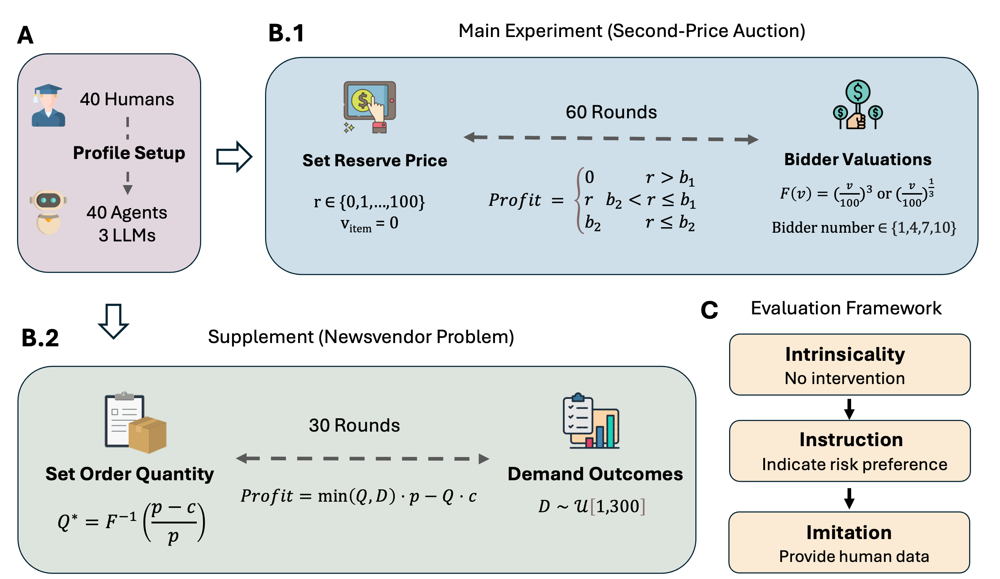

# Assess LLM Fidelity in Decision-Making

This repository contains the implementation and analysis of a comprehensive experimental framework for evaluating Large Language Model (LLM) fidelity in economic decision-making tasks. 

## Overview

The research employs a **process-oriented evaluation framework** that examines LLM behavior through three distinct experimental paradigms:

1. **Intrinsicality**: Testing LLMs' inherent decision-making capabilities without external guidance
2. **Instruction**: Evaluating how LLMs respond to explicit behavioral instructions (risk preferences)
3. **Imitation**: Assessing LLMs' ability to learn and replicate human decision patterns from historical data


## Experimental Framework Illustration

The complete experimental design and evaluation process is illustrated below:



*The illustration shows the process-oriented evaluation framework, including the three experimental paradigms (Intrinsicality, Instruction, Imitation) and their application to both auction and newsvendor decision-making scenarios.*

## Experimental Scenarios

### Second-Price Auction
Participants act as sellers in a simulated auction environment:
- **Task**: Set reservation prices for 60 consecutive auction rounds
- **Dynamics**: Variable number of buyers (1, 4, 7, or 10) with random willingness-to-pay values (0-100)
- **Objective**: Maximize profit through strategic reservation price setting


### Newsvendor
Participants manage inventory:
- **Task**: Determine optimal order quantities for 30 rounds
- **Dynamics**: Uncertain demand (1-300 units) with varying prices and costs
- **Objective**: Balance overstocking costs against stockout losses

## Experimental Paradigms

### 1. Intrinsicality
Tests the **inherent decision-making capabilities** of LLMs without external behavioral guidance.
- **Purpose**: Establish baseline LLM behavior patterns
- **Method**: LLMs make decisions based solely on game rules and economic incentives


### 2. Instruction
Evaluates **responsiveness to explicit behavioral instructions**.
- **Purpose**: Test whether LLMs can follow specific risk preference instructions, which are critical in human subjects' decision making process
- **Risk Profiles**:
  - **Risk-Averse**: "Prioritize lower-risk decisions to ensure positive profits"
  - **Risk-Seeking**: "Prioritize higher-risk decisions for potential of higher profits"

### 3. Imitation
Assesses **learning and replication of human decision patterns**.
- **Purpose**: Determine if LLMs can continue human decision strategies
- **Method**: Provide 30 rounds of human decision history, predict remaining 30 rounds
- **Imitation Modes**:
  - **Direct**: Unmodified human decision history
  - **Shuffle**: Randomized order of historical decisions
  - **Reverse**: Chronologically reversed decision sequence
  - **Mask**: Mask the round numbers
  - **RegionShuffle**: Shuffle history in a block

## Repository Structure

```
├── ExperimentDesign.png          
├── human_experiment/             # Human data
│   ├── auction_human_data.csv
│   └── newsvendor_human_data.csv
├── results/                      # LLM experimental results
│   ├── Auction/
│   │   ├── Intrinsicality/      
│   │   ├── Instruction/         
│   │   └── Imitation/           
│   └── Newsvendor/
│       ├── intrinsic.csv
│       ├── instruction.csv
│       └── imitation.csv
├── src/
│   ├── Auction/
│   │   ├── auction_analysis.ipynb        
│   │   └── execution/
│   │       ├── generation_execution.py   
│   │       ├── execution_guide.md       
│   │       └── experiment_instructions.txt
│   ├── Newsvendor/
│   │   ├── newsvendor_analysis.ipynb     
│   │   └── newsvendor_generation.ipynb   
│   └── profile_generation/              
│       ├── generate_profiles.ipynb
│       └── umich_undergraduate_profiles.xlsx
```

